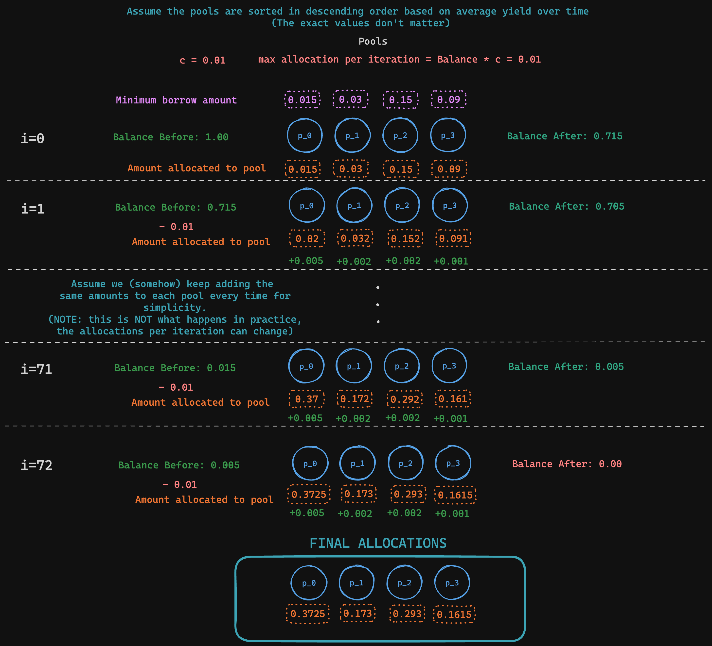
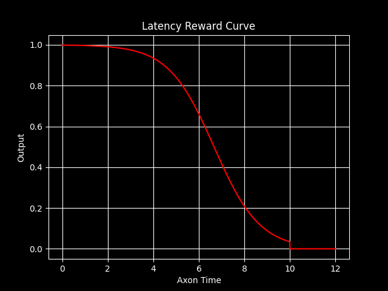

<div align="center">

# **Sturdy Subnet** <!-- omit in toc -->

[](https://opensource.org/licenses/MIT) 

---

## Decentralized Yield Farming Fund <!-- omit in toc -->
</div>

- [Introduction](#introduction)
  - [Subnet Overview](#subnet-overview)
- [Installation](#installation)
  - [Before you proceed](#before-you-proceed)
  - [Install](#install)
- [License](#license)

---

## Introduction

The Sturdy Subnet is a Bittensor subnetwork that enables the creation of decentralized, autonomous yield optimizers. A yield optimizer is a smart contract that seeks to provide users with the best possible yields by depositing assets to a variety of strategies. On the Sturdy Subnet, every yield optimizer has a fixed set of strategies (or 'pools') that it can deposit to. In turn, each pool has its own interest rate curve, described in more detail below. The goal for each miner is to create an algorithm that computes the allocation of assets among pools that results in the highest yield possible. Validators then evaluate miners based on how much yield their allocation produces. 

The outputs of the subnet will be used by third-party applications to move real assets on the Ethereum network. The first application using the Sturdy Subnet is the [Sturdy protocol](https://sturdy.finance/), with more to come.

### Codebase

There are three core files. 
1. `sturdy/protocol.py`: Contains the definition of the protocol used by subnet miners and subnet validators. At the moment it only has one kind of synapse - `AllocateAssets` - which contains the inputs (`assets_and_pools`) validators need to send to miners to generate return `allocations` for. See `generate_assets_in_pools()` in [pools.py](./sturdy/pools.py) to see how assets and pools are defined.
2. `neurons/miner.py`: Script that defines the subnet miner's behavior, i.e., how the subnet miner responds to requests from subnet validators.
3. `neurons/validator.py`: This script defines the subnet validator's behavior, i.e., how the subnet validator requests information from the subnet miners and determines the scores.

### Subnet Overview
- Validators are responsible for distributing lists of pools (of which contain relevant parameters such as base interest rate, base interest rate slope, minimum borrow amount, etc), as well as a maximum token balance miners can allocate to pools. Below is the function present in the codebase used for generating a dummy `assets_and_pools` taken from [pools.py](./sturdy/pools.py):
    ```python
    def generate_assets_and_pools() -> typing.Dict:  # generate pools
    assets_and_pools = {}
    pools = {
        str(x): {
            "pool_id": str(x),
            "base_rate": randrange_float(MIN_BASE_RATE, MAX_BASE_RATE, BASE_RATE_STEP),
            "base_slope": randrange_float(MIN_SLOPE, MAX_SLOPE, SLOPE_STEP),
            "kink_slope": randrange_float(
                MIN_KINK_SLOPE, MAX_KINK_SLOPE, SLOPE_STEP
            ),  # kink rate - kicks in after pool hits
            "optimal_util_rate": OPTIMAL_UTIL_RATE,  # optimal utility rate - after which the kink slope kicks in >:)
            "borrow_amount": randrange_float(
                MIN_BORROW_AMOUNT,
                MAX_BORROW_AMOUNT,
                BORROW_AMOUNT_STEP,
            ),
        }
        for x in range(NUM_POOLS)
    }

    assets_and_pools["total_assets"] = TOTAL_ASSETS
    assets_and_pools["pools"] = pools

    return assets_and_pools
    ```
    Validators can optionally run an API server and sell their bandwidth to outside users to send their own pools to the subnet. For more information on this process - please read [docs/validator.md](docs/validator.md)

- The miners, after receiving these pools from validators, must then attempt to allocate the `TOTAL_ASSETS` into the given pools, with the ultimate goal of trying to maximize their yield. This repository comes with a default asset allocation algorithm in the form of `greedy_allocation_algorithm` (a greedy allocation algorithm) in [misc.py](./sturdy/utils/misc.py). The greedy allocation essentially works by breaking its assets into many chunks of small sizes, and allocating them into the pools by utilizing their current yields to determine its allocations to each pool (it is done this way because the yields of the pools are dynamic based on their various parameters - most notably it's `utilization rate = borrow amount / total available tokens`). A diagram is provided below for the more visually attuned: 



- After generating allocations, miners then send their outputs to validators to be scored. The scores of miners are determined based on their relative yields their response latency. This means that the fastest, best allocating miner will receive the most emissions, with an `80%` weight placed on yield alone, and the other `20%` being dependent on miner latency. The resulting score is between a range of `0-1`. In math speak: $$s_{{k}} = 0.8y_k + 0.2r_k $$ where $s_k$, $y_k$, and $r_k$ are the score, yield, latency of miner $k$ respectively. The reward curve of $r_k$ is determined by a sigmoid curve with response time being the function (see below). Note: The timeout for a miner is 10 seconds, hence why the reward for >= 10s of response time is 0. For more information on how miners are rewarded - please see [reward.py](sturdy/validator/reward.py).

<div align="center"> 
    
</div> 

---

## Installation

### Before you proceed
Before you proceed with the installation, note the following: 

- Python version `3.10.x` is required to run code in this repo. We highly recommend that you use some thing like `conda` to create virtual environments with its own python `3.10.x` interpreter. For more information on how to do this, please refer to conda's documentation regarding [installation](https://docs.anaconda.com/free/miniconda/#quick-command-line-install) and [environment creation](https://conda.io/projects/conda/en/latest/user-guide/tasks/manage-python.html#installing-a-different-version-of-python).
- **IMPORTANT:** Make sure you are aware of the minimum compute requirements for your subnet. See the [Minimum compute YAML configuration](./min_compute.yml).
- Note that installation instructions differ based on your situation: For example, installing for local development and testing will require a few additional steps compared to installing for testnet or mainnet. For running a local subtensor - please visit: [https://github.com/opentensor/subtensor](https://github.com/opentensor/subtensor).

### Install
```bash
git clone https://github.com/Sturdy-subnet/sturdy-subnet/
cd sturdy-subnet
python -m pip install -e .
```

<!-- - **Running locally**: Follow the step-by-step instructions described in this section: [Running Subnet Locally](./docs/running_on_staging.md).
- **Running on Bittensor testnet**: Follow the step-by-step instructions described in this section: [Running on the Test Network](./docs/running_on_testnet.md).
- **Running on Bittensor mainnet**: Follow the step-by-step instructions described in this section: [Running on the Main Network](./docs/running_on_mainnet.md). -->

---
## Setup WandB (HIGHLY RECOMMENDED - VALIDATORS PLEASE READ)

Before running your miner and validator, you may also choose to set up Weights & Biases (WANDB). It is a popular tool for tracking and visualizing machine learning experiments, and we use it for logging and tracking key metrics across miners and validators, all of which is available publicly [here](https://wandb.ai/shr1ftyy/sturdy-subnet/table?nw=nwusershr1ftyy). We ***highly recommend*** validators use wandb, as it allows subnet developers and miners to diagnose issues more quickly and effectively, say, in the event a validator were to be set abnormal weights. Wandb logs are collected by default, and done so in an anonymous fashion, but we recommend setting up an account to make it easier to differentiate between validators when searching for runs on our dashboard. If you would *not* like to run WandB, you can do so by adding the flag `--wandb.off` when running your miner/validator.

Before getting started, as mentioned previously, you'll first need to [register](https://wandb.ai/login?signup=true) for a WANDB account, and then set your API key on your system. Here's a step-by-step guide on how to do this on Ubuntu:

#### Step 1: Installation of WANDB

Before logging in, make sure you have the WANDB Python package installed. If you haven't installed it yet, you can do so using pip:

```bash
# Should already be installed with the sturdy repo
pip install wandb
```

#### Step 2: Obtain Your API Key

1. Log in to your Weights & Biases account through your web browser.
2. Go to your account settings, usually accessible from the top right corner under your profile.
3. Find the section labeled "API keys".
4. Copy your API key. It's a long string of characters unique to your account.

#### Step 3: Setting Up the API Key in Ubuntu

To configure your WANDB API key on your Ubuntu machine, follow these steps:

1. **Log into WANDB**: Run the following command in the terminal:

   ```bash
   wandb login
   ```

2. **Enter Your API Key**: When prompted, paste the API key you copied from your WANDB account settings. 

   - After pasting your API key, press `Enter`.
   - WANDB should display a message confirming that you are logged in.

3. **Verifying the Login**: To verify that the API key was set correctly, you can start a small test script in Python that uses WANDB. If everything is set up correctly, the script should run without any authentication errors.

4. **Setting API Key Environment Variable (Optional)**: If you prefer not to log in every time, you can set your API key as an environment variable in your `~/.bashrc` or `~/.bash_profile` file:

   ```bash
   echo 'export WANDB_API_KEY=your_api_key' >> ~/.bashrc
   source ~/.bashrc
   ```

   Replace `your_api_key` with the actual API key. This method automatically authenticates you with wandb every time you open a new terminal session.


---

## Running
### Acknowledgement for [Vision Subnet](https://github.com/namoray/vision/)!

We extend our heartfelt appreciation to namoray et al. for their exceptional work on the Vision subnet. Our API, which enables third-party applications to integrate the subnet, draws significant inspiration from their work.

### [Miner](docs/miner.md)
### [Validator](docs/validator.md)

## License
This repository is licensed under the MIT License.
```text
# The MIT License (MIT)
# Copyright © 2023 Syeam Bin Abdullah

# Permission is hereby granted, free of charge, to any person obtaining a copy of this software and associated
# documentation files (the “Software”), to deal in the Software without restriction, including without limitation
# the rights to use, copy, modify, merge, publish, distribute, sublicense, and/or sell copies of the Software,
# and to permit persons to whom the Software is furnished to do so, subject to the following conditions:

# The above copyright notice and this permission notice shall be included in all copies or substantial portions of
# the Software.

# THE SOFTWARE IS PROVIDED “AS IS”, WITHOUT WARRANTY OF ANY KIND, EXPRESS OR IMPLIED, INCLUDING BUT NOT LIMITED TO
# THE WARRANTIES OF MERCHANTABILITY, FITNESS FOR A PARTICULAR PURPOSE AND NONINFRINGEMENT. IN NO EVENT SHALL
# THE AUTHORS OR COPYRIGHT HOLDERS BE LIABLE FOR ANY CLAIM, DAMAGES OR OTHER LIABILITY, WHETHER IN AN ACTION
# OF CONTRACT, TORT OR OTHERWISE, ARISING FROM, OUT OF OR IN CONNECTION WITH THE SOFTWARE OR THE USE OR OTHER
# DEALINGS IN THE SOFTWARE.
```
