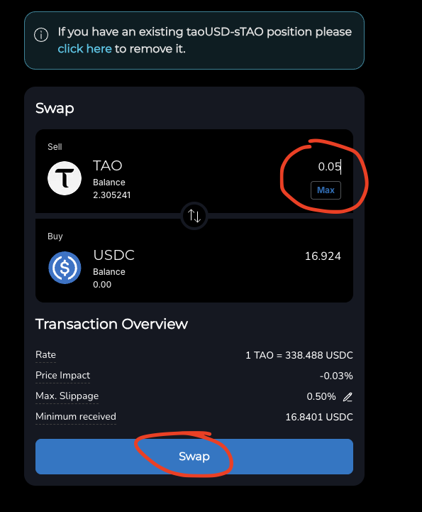
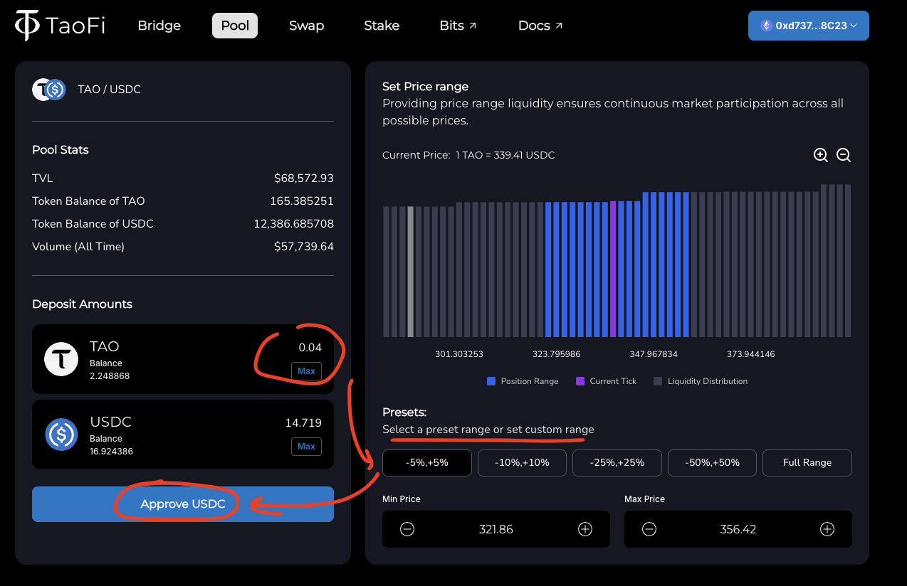
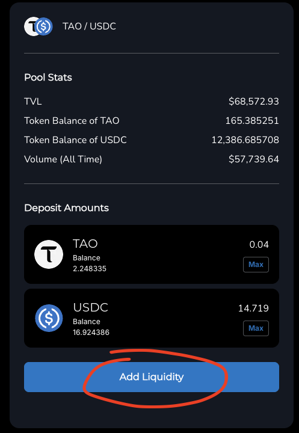
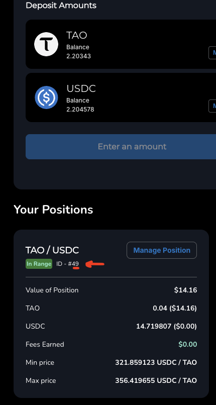

# TaoFi Liquidity Provider Miner Setup

## Providing liquidity to the TaoFi TAO<>USDC pool

### EVM Wallet
The first step is to actually start providing liquidity to the TaoFi TAO<>USDC pool. To do this you;ll need to set up an EVM wallet that is compatible with the TaoFi platform. 
We recommend using [MetaMask](https://metamask.io/) for this.

### Providing Liquidity
- First, head to [https://www.taofi.com/swap](https://www.taofi.com/swap)
- Connect your wallet to the TaoFi platform:

    
- You can now swap some TAO for USDC, or vice versa. You will need both tokens in your wallet to provide liquidity.

    

- Once you have both tokens, head to [https://www.taofi.com/pool](https://www.taofi.com/pool), select the amount of TAO you want to deposit into the pool, the tick price range. Then, you will need to Approve the USDC token to be deposited into the pool, and finally, click on the "Add Liquidity" button to provide liquidity to the pool.

Approve             |  Add Liquidity
:-------------------------:|:-------------------------:
  | 

- You will then be able to view your position in the pool. Make sure to note down it's position ID, as you will need it later to receive rewards from the Sturdy Subnet.

    

## Running the Miner
- Edit your `.env` file to include the seed phrase for the EVM wallet you used to provide liquidity to the pool:

```plaintext
UNISWAP_POS_OWNER_KEY="your seed phrase here"
```
- Change the token ids that the mienr will respond with in `uniswap_v3_lp_forward` in [uniswap_lp.py](../neurons/uniswap_lp.py) to bethe positions you own:
```python
async def uniswap_v3_lp_forward(
    self, synapse: sturdy.protocol.UniswapV3PoolLiquidity
) -> sturdy.protocol.UniswapV3PoolLiquidity:
    bt.logging.warning("Received UniswapV3PoolLiquidity synapse")
    # set the token ids of your position
    synapse.token_ids = [36] # <-- replace with your position token id(s)
    # sign the message with your wallet that owns the position(s)
    message = encode_defunct(text=synapse.message)
    signed_msg: SignedMessage = self.test_w3.eth.account.sign_message(message, private_key=self.uniswap_pos_owner_key)
    synapse.signature = signed_msg.signature.hex()

    return synapse
```
- Then start your miner as shown shown in [Starting a miner](miner.md#starting-a-miner)