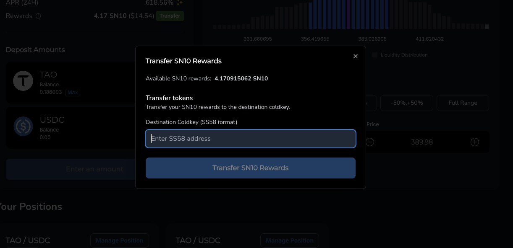

# Earning Rewards by providing Liquidity to the TaoFi TAO<>USDC pool

## Providing liquidity to the TaoFi TAO<>USDC pool

### EVM Wallet
The first step is to actually start providing liquidity to the TaoFi TAO<>USDC pool. To do this you'll need to set up an EVM wallet that is compatible with the TaoFi platform.
We recommend using [MetaMask](https://metamask.io/) for this.

### Providing Liquidity
- First, head to [https://www.taofi.com/swap](https://www.taofi.com/swap)
- Connect your wallet to the TaoFi platform:

    
- You can now swap some TAO for USDC, or vice versa. You will need both tokens in your wallet to provide liquidity.

    

- Once you have both tokens, head to [https://www.taofi.com/pool](https://www.taofi.com/pool), select the amount of TAO you want to deposit into the pool, the tick price range. Then, you will need to Approve the USDC token to be deposited into the pool, and finally, click on the "Add Liquidity" button to provide liquidity to the pool.

Approve             |  Add Liquidity
:-------------------------:|:-------------------------:
  | 

- You will then be able to view your position in the pool. Make sure to note down it's position ID, as you will need it later to receive rewards from the Swap Subnet.

    

- You will now earn rewards from the pool as long as your position(s) are in-range, and receive fees from the trades that occur in the pool. Rewards will be automatically distributed on a daily basis to your wallet address, and can be viewed and transferred here:

    
    

## Running a Miner (OPTIONAL)

You may optionally register a hotkey and run a miner to earn SN10 alpha tokens, and instead of receiving rewards directly to your wallet, you will receive them to your miner's hotkey address.

### Setup Environment
- Edit your `.env` file to include the private key for the EVM wallet you used to provide liquidity to the pool:
```plaintext
EVM_KEY="your_private_key_here"
```

### Commit Miner Type
Before starting your TaoFi liquidity provider miner, you need to commit your miner type to the network:

```bash
python3 scripts/commit.py --netuid NETUID --subtensor.network NETWORK --wallet.name NAME --wallet.hotkey HOTKEY --miner-type UNISWAP_V3_LP
```

This script will:
1. Commit your miner type as `UNISWAP_V3_LP`
2. Automatically generate a signature and associate your EVM address with your hotkey
