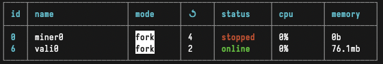

# Validator Setup

### Hardware

See [min_compute.yml](../min_compute.yml)

# Setup steps

### Clone the repo
```bash
git clone https://github.com/Sturdy-Subnet/sturdy-subnet/
cd sturdy-subnet
```

### Install python dependencies
Make sure you have installed the correct python version, and then follow these steps:

```bash
### Install the local python environment
pip install --upgrade pip
pip install -e .
```

### Install node and pm2
You will need `pm2` if you would like to utilize the auto update scripts that comes with this repository

1. Install [node and npm](https://docs.npmjs.com/downloading-and-installing-node-js-and-npm)
2. Install [pm2](https://pm2.io)


## Running a Validator

#### Local subtensor
Before running a validator it is **highly** recommended that you run a local subtensor vs. just connecting to the `finney` endpoint. Instructions for setting up a local subtensor can be found [here](https://github.com/opentensor/subtensor/blob/main/docs/running-subtensor-locally.md).

Now - let's get to the good stuff.

#### Validator types
You have the option of running two kinds of validators:
 - [Synthetic](#synthetic-validator)
 - [Organic](#organic-validator)

## Synthetic Validator 
This is the most simple of the two. Synthetic validators generate dummy (fake) pools to send to miners to challenge them. To run a synthetic validator, run:
#### Starting the validator - without PM2
```bash
python3 neurons/validator.py --netuid NETUID --subtensor.network NETWORK --wallet.name NAME --wallet.hotkey HOTKEY --logging.trace --axon.port PORT --organic False
```

#### Starting the validator - with PM2 (REQUIRED FOR AUTOUPDATES)
```
pm2 start --name PROC_NAME --interpreter=python3 neurons/validator.py -- --netuid NETUID --subtensor.network NETWORK --wallet.name NAME --wallet.hotkey HOTKEY --logging.trace --axon.port PORT --organic False
```

Replace, `PROC_NAME`, `NAME`, `NETWORK`, `HOTKEY`, `PORT` with your desired values. As mentioned in our [README](../README.md) we ***highly recommend*** that validators run a local subtensor and use `local` in place of the `NETWORK` parameter.

**Note**: If you would like to participate in the testnet replace `NETUID` with `104`

### Autoupdate script

List pm2 processes:
```
pm2 ls
```
You should see a list of processes as show below: \
 \
Take note of either the `id` or `name` of the process - you'll need it going forward. For our case (as seen in the picture above) our validator's id is `6` and it's name is `vali0` 

Run the following command to run the auto updater script. This will periodically scan the upstream branch, pull when there are changes, reinstall the repo, and finall restart the validator automatically:

```
pm2 start --name run_validator_auto_update --interpreter=python3 run_validator_auto_update.py -- --proc ID_OR_PROCESS_NAME
```

Where `ID_OR_PROCESS_NAME` is the `name` OR `id` of the process as noted per the previous step. 

## Organic Validator 
This is the less simple but more exciting of the two! Now you get to sell your bandwidth to whoever you want, with a very simple to use CLI!

#### Connecting to Ethereum
Organic validators are required to have a connection to an Ethereum RPC to handle organic requests. It is required to interact with relevant smart contracts in order to perform certain operations i.e. calculate miner allocation yields.

##### Preparing Environment
The next step involves interacting with an API. We've provided an [.env.example](../.env.example) file which should be copied as a `.env` file in the root of this repository before proceeding.

#### Connecting to a Web3 Provider
We recommend using a third party service to connect to an RPC to perform on-chain calls such as [Infura](https://docs.infura.io/dashboard/create-api) and [Alchemy](https://docs.alchemy.com/docs/alchemy-quickstart-guide#1key-create-an-alchemy-api-key) (click on hyperlinks links for documentation) by obtaining there API key and adding their URL to the `.env` file under the `WEB3_PROVIDER_URL` alias.

#### Spinning Up Organic Validator

The steps are similar to synthetic only validators:

Before you start the validator, run the command
```bash
lsof -i -P -n | grep LISTEN
```

This shows you all the ports currently in use. When you come to choose a port for running the api server, make sure the ports you choose aren't already in use.

Example output:


This shows that ports 9091, 3001, .., 34579, 41133 etc, are currently in use, so pick address that don't include these.

#### Starting the validator and API server - without PM2
```bash
python neurons/validator.py --netuid NETUID --subtensor.network local --wallet.name NAME --wallet.hotkey HOTKEY --logging.trace --axon.port PORT --organic True --api_port API_PORT
```

#### Starting the validator and API server - with PM2 (REQUIRED FOR AUTOUPDATES)
```
pm2 start --name PROC_NAME --interpreter=python3 neurons/validator.py -- --netuid NETUID --subtensor.network local --wallet.name NAME --wallet.hotkey HOTKEY --logging.trace --axon.port PORT --organic True --api_port API_PORT
```

Replace, `PROC_NAME`, `NAME`, `NETWORK`, `HOTKEY`, `PORT`, `API_PORT` with your desired values. As mentioned in our [README](../README.md) we ***highly recommend*** that validators run a local subtensor and use `local` in place of the `NETWORK` parameter.

**Note**: If you would like to participate in the testnet replace `NETUID` with `104`

### Autoupdate script

List pm2 processes:
```
pm2 ls
```
You should see a list of processes as show below: \
 \
Take note of either the `id` or `name` of the process - you'll need it going forward. For our case (as seen in the picture above) our validator's id is `6` and it's name is `vali0` 

Run the following command to run the auto updater script. This will periodically scan the upstream branch, pull when there are changes, reinstall the repo, and finall restart the validator automatically:

```
pm2 start --name run_validator_auto_update --interpreter=python3 run_validator_auto_update.py -- --proc ID_OR_PROCESS_NAME
```

Where `ID_OR_PROCESS_NAME` is the `name` OR `id` of the process as noted per the previous step. 

## Selling your bandwidth

### Creating the database
Used to store api keys & scoring logs

First, [install dbmate](https://github.com/amacneil/dbmate?tab=readme-ov-file#installation)

```bash
dbmate --url "sqlite:validator_database.db" up
```

### Managing access

To manage access to the your api server and sell access to anyone you like, using the sturdy-cli is the easiest way.

```bash
sturdy --help
```

Shows all the commands and should give self explanatory instructions.

You can also do

```bash
sturdy some-command --help
```

To get more info about that command!

# Examples

For example:

```bash
sturdy create-key 10 60 test
```
Creates a test key with a balance of 10 (which corresponds to 10 requests), a rate limit of 60 requests per minute = 1/s, and a name 'test'.

<!-- **Recommend values:**
- Balance: Depends on how much you want to sell! Each credit is a image (so a balance of 1000 will allow 1000 images to be generated)
- Rate limit: I would recommend a rate limit of ~20/minute for casual users trying out the API, and around ~120/minute for production users
- Name: Just for you to remember who you want to use that key :) -->

Now you can do:
```bash
sturdy list-keys
```
To see the API key. Give / sell this access to whoever you want to have access to your API server to query the network organically - these will be scored too!

## Allowing people to access your server
For them to use your server, you will need to communicate:

- Your server address (IP_ADDRESS:PORT)
- Use /redoc or /docs for automatic documentation on how to use it!

Just for reference - below is an example `curl` command which could be used to interact with an organic validator:

```bash
curl -X POST \
  http://{HOST_ADDRESS}/allocate \
  -H 'Content-Type: application/json' \
  -H 'Authorization: Bearer {API_KEY}' \
  -d '{
  "request_type": "ORGANIC",
  "user_address": "0x73E4C11B670Ef9C025A030A20b72CB9150E54523",
  "assets_and_pools": {
    "total_assets": 548568963376234830607950,
    "pools": {
      "0x6311fF24fb15310eD3d2180D3d0507A21a8e5227": {
        "pool_type": "STURDY_SILO",
        "pool_model_disc": "CHAIN",
        "contract_address": "0x6311fF24fb15310eD3d2180D3d0507A21a8e5227"
      },
       "0x200723063111f9f8f1d44c0F30afAdf0C0b1a04b": {
        "pool_type": "STURDY_SILO",
        "pool_model_disc": "CHAIN",
        "contract_address": "0x200723063111f9f8f1d44c0F30afAdf0C0b1a04b"
      },
       "0x26fe402A57D52c8a323bb6e09f06489C8216aC88": {
        "pool_type": "STURDY_SILO",
        "pool_model_disc": "CHAIN",
        "contract_address": "0x26fe402A57D52c8a323bb6e09f06489C8216aC88"
      },
       "0x8dDE9A50a91cc0a5DaBdc5d3931c1AF60408c84D": {
        "pool_type": "STURDY_SILO",
        "pool_model_disc": "CHAIN",
        "contract_address": "0x8dDE9A50a91cc0a5DaBdc5d3931c1AF60408c84D"
      }
    }
  }
}'
```

Some annotations are provided below to further help understand the request format:
```bash
  "request_type": "ORGANIC", # request type
  "user_address": "0x73E4C11B670Ef9C025A030A20b72CB9150E54523", # this tends to be an aggregator address
  "assets_and_pools": {
    "total_assets": 548568963376234830607950, # total assets available to a miner to allocate
    "pools": { # pools available to output allocations for
      "0x6311fF24fb15310eD3d2180D3d0507A21a8e5227": { # address used to get relevant info about the the pool
        "pool_type": "STURDY_SILO", 
        "pool_model_disc": "CHAIN", # if this is a synthetic or chain (organic) pool 
        "contract_address": "0x6311fF24fb15310eD3d2180D3d0507A21a8e5227" # address used to get relevant info about the the pool
      },
```

And the corresponding response(example) format from the subnet:
```bash
{
    "request_uuid":"1e09d3f1ce574921bd13a2461607f5fe",
    "allocations":{
        "1":{ # miner uid
            "apy":62133011236204113, # apy of miner's allocations in 18 decimal precision because the asset has the same precision. 
            "allocations":{ # allocations to pools in wei
                "0x6311fF24fb15310eD3d2180D3d0507A21a8e5227":114864688949643874140160,
                "0x200723063111f9f8f1d44c0F30afAdf0C0b1a04b":1109027125282399872,
                "0x26fe402A57D52c8a323bb6e09f06489C8216aC88":71611128603622265323520,
                "0x8dDE9A50a91cc0a5DaBdc5d3931c1AF60408c84D":3594097438744
            }
        },
        "4":{
            "apy":61332661325287823,
            "allocations":{
                "0x6311fF24fb15310eD3d2180D3d0507A21a8e5227":119201178628424617426944,
                "0x200723063111f9f8f1d44c0F30afAdf0C0b1a04b":1290874337673458688,
                "0x26fe402A57D52c8a323bb6e09f06489C8216aC88":74795928505515430117376,
                "0x8dDE9A50a91cc0a5DaBdc5d3931c1AF60408c84D":4534575558121
            }
        },
        "2":{
            "apy":31168293423379011,
            "allocations":{
                "0x6311fF24fb15310eD3d2180D3d0507A21a8e5227":45592862828746122461184,
                "0x200723063111f9f8f1d44c0F30afAdf0C0b1a04b":172140896186699296,
                "0x26fe402A57D52c8a323bb6e09f06489C8216aC88":53871255848631538810880,
                "0x8dDE9A50a91cc0a5DaBdc5d3931c1AF60408c84D":465839210713
            }
        }
    }
}
```
